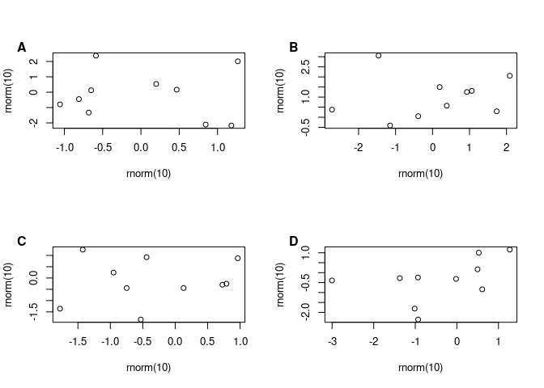

Combine multiple plots on one panel
================
N. Schenk
2022-04-12

I am personally a big fan of the `cowplot::plot_grid()` function to
combine multiple plots on one panel, labelling them e.g. with letters A,
B, C. The plots just look publication ready!

However, `cowplot::plot_grid()` requires `ggplot` objects as inputs, and
is therefore not compatible with plots generated from packages not using
ggplot2.

This does not mean that R base can not do the job! R base is so
versatile, just needs some special attention to the details. Below you
find example code.

# Panel plots in R base

``` r
# use par() to arrange multiple plots together. Here, it is 4 plots (2 rows and 2 columns)
par(mfrow = c(2, 2)) 
# add the plot itself
plot(rnorm(10), rnorm(10))
# add the Label on top left
mtext("A", 2, adj=1, line=2, las = 1, padj = -4, font = 2)
# Note : probably you have to play around with the padj parameter. You could e.g. first try -4 as here,
# and if you don't see the label, try 0 and then adjust.

# add the other 3 plots : 
plot(rnorm(10), rnorm(10))
mtext("B", 2, adj=1, line=2, las = 1, padj = -4, font = 2)
plot(rnorm(10), rnorm(10))
mtext("C", 2, adj=1, line=2, las = 1, padj = -4, font = 2)
plot(rnorm(10), rnorm(10))
mtext("D", 2, adj=1, line=2, las = 1, padj = -4, font = 2)
```

<!-- -->

Adjusting the size of the labels.

``` r
par(mfrow = c(2, 2)) 

# labels in italics with font = 4
plot(rnorm(10), rnorm(10), main = "labels in italic font")
mtext("A", 2, adj=1, line=2, las = 1, padj = -4, font = 4)

# labels not bold with font = 3
plot(rnorm(10), rnorm(10), main = "labels not bold")
mtext("B", 2, adj=1, line=2, las = 1, padj = -4, font = 3)

# changing the label size with cex = 4
# additionally, you might have to adjust the horizontal (adj) and vertical (padj) parameters : 
#  e.g. adj = 0, padj = -1
plot(rnorm(10), rnorm(10), main = "large label")
mtext("C", 2, adj = 0, line = 2, las = 1, padj = -1, font = 2, cex = 4)

# medium size labels
plot(rnorm(10), rnorm(10), main = "medium label")
mtext("D", 2, adj = 0, line = 2, las = 1, padj = -2, font = 2, cex = 2)
```

<!-- -->

``` r
dev.off() # re-set previous graphic settings to default
```

    ## null device 
    ##           1

# Panel plots with ggplot2 and cowplot

load requirements

``` r
library(ggplot2)
library(cowplot)
```

Basic panel plot with ggplot and cowplot

``` r
dat <- data.frame("vertical" = rnorm(10), "horizontal" = rnorm(10))
a <- ggplot(dat, aes(x = horizontal, y = vertical)) +
  geom_point()
b <- ggplot(dat, aes(x = horizontal, y = vertical)) +
  geom_point()

plot_grid(a, b, nrow = 2, labels = c("A", "B"))
```

<!-- -->

Adjusting the label size

``` r
# you can adjust the label size with the label_size parameter
#  e.g. setting label_size = 20
plot_grid(a, b, nrow = 2, labels = c("A", "B"), label_size = 20)
```

<!-- -->
