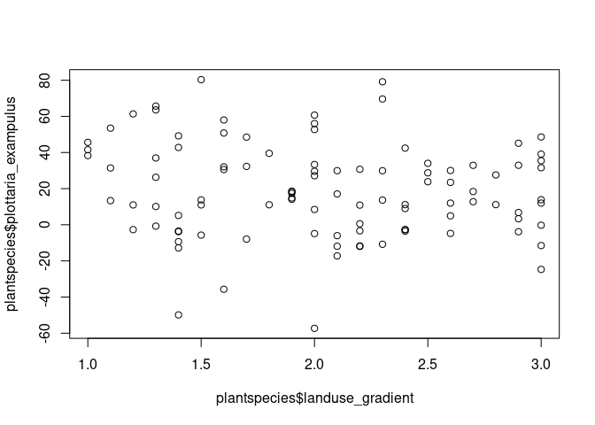
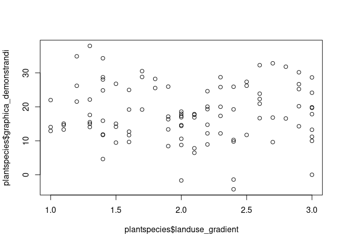
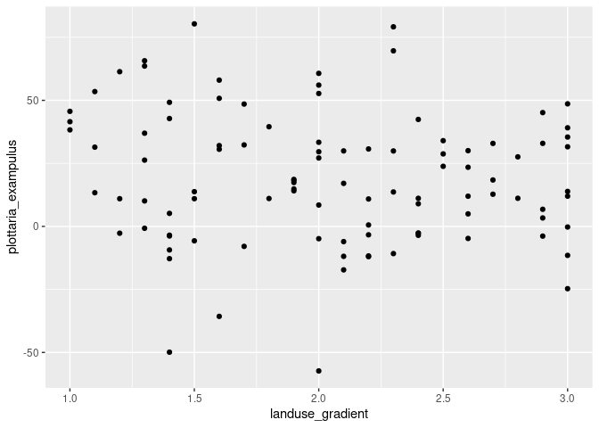
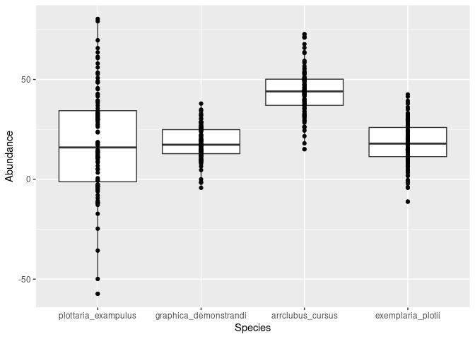

Reshape datasets for ggplot2
================
N. Schenk
2022-11-23

The `ggplot2` package is super useful. However, it requires a specific
input format, which is sometimes not the format in which we collected
the data. Below you find a minimal example of reshaping.

## Requirements

``` r
library(ggplot2)
library(reshape2)
```

## Build example dataset

Plant species abundance, samples in 100 plots for 4 species.

``` r
# create an example dataset "plantspecies"
landuse_gradient = sample(seq(1, 3, 0.1), 100, replace = T)
plantspecies <- data.frame(plotID = as.factor(seq(1, 100, 1)),
                           landuse_gradient = sample(seq(1, 3, 0.1), 100, replace = T),
                           plottaria_exampulus = 2*landuse_gradient + 12 + rnorm(100, mean = 12/3, sd = 12/0.5),
                           graphica_demonstrandi = 3*landuse_gradient + 8 + rnorm(100, mean = 8/2, sd = 8/1),
                           arrclubus_cursus = 2.5*landuse_gradient + 25 + rnorm(100, mean = 25/2, sd = 25/2),
                           exemplaria_plotii = 3*landuse_gradient + 9 + rnorm(100, mean = 9/2, sd = 9/0.8))
head(plantspecies)
```

    ##   plotID landuse_gradient plottaria_exampulus graphica_demonstrandi
    ## 1      1              2.4           -2.634161              9.782723
    ## 2      2              2.0           56.042312              8.763045
    ## 3      3              1.0           38.289902             12.905921
    ## 4      4              2.7           32.910272             16.839352
    ## 5      5              1.4           49.203115             34.306213
    ## 6      6              2.4           -2.730425             10.250474
    ##   arrclubus_cursus exemplaria_plotii
    ## 1         51.06714         27.877868
    ## 2         41.61718         27.192039
    ## 3         47.31504          1.718815
    ## 4         59.33471          4.500358
    ## 5         39.39994         24.164226
    ## 6         54.06220         24.289276

``` r
rm(landuse_gradient)
```

## Transform from wide to long format

The dataset is in wide format : every plant species has its own column.
This is very convenient to plot results for individual plant species
(see example below), but not for plotting overviews like in a boxplot of
abundance per plantspecies.

``` r
# only possible to plot 1 plant species at a time
# R base plots
plot(plantspecies$landuse_gradient, plantspecies$plottaria_exampulus)
```

<!-- -->

``` r
plot(plantspecies$landuse_gradient, plantspecies$graphica_demonstrandi)
```

<!-- -->

``` r
# GGplot example
ggplot(plantspecies, aes(x = landuse_gradient, y = plottaria_exampulus)) +
  geom_point()
```

<!-- -->

Transform to long format

``` r
# bring to ggplot format, using the package reshape2
plantspecies_long <- melt(plantspecies, 
          id.vars = c("plotID", "landuse_gradient"),
          measure.vars = c("plottaria_exampulus", "graphica_demonstrandi", "arrclubus_cursus", "exemplaria_plotii"),
          value.name = "Abundance",
          variable.name = "Species")
# minimal example
head(melt(plantspecies, id.vars = c("plotID", "landuse_gradient")))
```

    ##   plotID landuse_gradient            variable     value
    ## 1      1              2.4 plottaria_exampulus -2.634161
    ## 2      2              2.0 plottaria_exampulus 56.042312
    ## 3      3              1.0 plottaria_exampulus 38.289902
    ## 4      4              2.7 plottaria_exampulus 32.910272
    ## 5      5              1.4 plottaria_exampulus 49.203115
    ## 6      6              2.4 plottaria_exampulus -2.730425

``` r
# all the other parameters are guessed from the input = the function knows itself what to do
# if you just tell it which columns need to stay.
# note that you will have to remove the "head()" function when using for your own data

# Plot dataset
ggplot(plantspecies_long, aes(x = Species, y = Abundance)) +
  geom_boxplot() +
  geom_point()
```

<!-- -->
