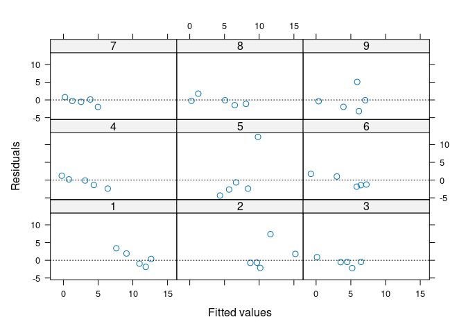
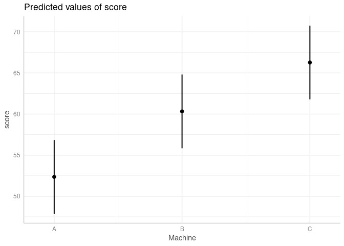
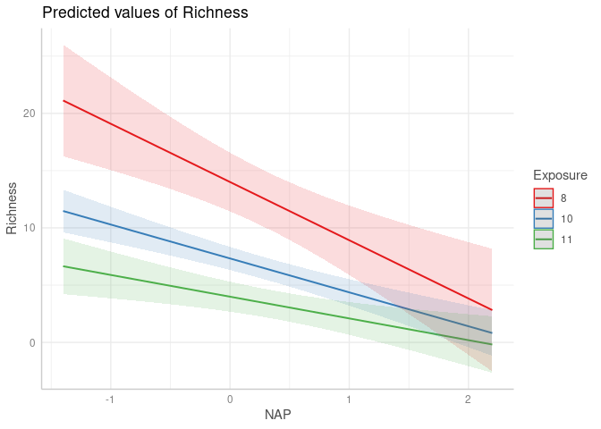

Mixed Effects Models Cheatsheet
================
N. Schenk
2022-11-17

# Mixed Effects models

## Aim

This is not a real tutorial but rather a cheatsheet to quickly look up
things you already learned but keep forgetting:)

## dependencies

Packages

``` r
library(nlme) # used in Zuur et al. primarily
library(lme4) # other package for mixed effects models
```

    ## Loading required package: Matrix

    ## 
    ## Attaching package: 'lme4'

    ## The following object is masked from 'package:nlme':
    ## 
    ##     lmList

``` r
# helper packages
library(car) # for qqPlot function
```

    ## Loading required package: carData

``` r
library(emmeans) # copute contrats for multilevel factors
library(ggeffects) # produce nice marginal plots
library(sjPlot) # help with visualisations
library(glmmTMB) # required by sjPlot

# AED is the package accompanying the Book from Zuur et al.
# install.packages("remotes")
# remotes::install_github("romunov/AED")
library(AED)

# overview table
tab1_compare_lme4_nlme <- read.table("table1_compare_lme4_nlme.csv", sep = ";", header = T, encoding = "UTF-8")
# note, if this line does not work, try "Tutorials/..." as file name

# # Function for plotting residuals
# #
# # creates a Tukey-Anscombe plot and a QQPlot
# # Tukey-Anscombe-plot : check heterogeneity of residuals
# # QQPlot : check normality of residuals
# library(car)
# plotresid <- function(lmodel) {
#   # plots the residuals of a linear model; requires loading package car
#   par(mfrow = c(1, 2))
#   plot(fitted(lmodel), resid(lmodel), xlab = "Fitted values", ylab = "Residuals", 
#        main = "TA plot")
#   qqPlot(resid(lmodel), dist = "norm", mean = mean(resid(lmodel)), sd = sd(resid(lmodel)),
#          xlab = "Theoretical quantiles", ylab = "Empirical quantiles",
#          main = "Q-Q plot of residuals")
# }
```

Datasets

``` r
data("RIKZ")     # from the AED package
data("Machines") # from the nlme package
```

## Resources

- Book : Zuur, A., Ieno, E. N., Walker, N., Saveliev, A. A., &
  Smith, G. M. (2009). Mixed effects models and extensions in ecology
  with R (2009th ed.). Springer.
- nice Tutorial :
  <https://ourcodingclub.github.io/tutorials/mixed-models/> (thanks
  Marta for finding)
- Tutorial about factors (incl. mixed effects models) :
  <http://courses.atlas.illinois.edu/spring2016/STAT/STAT200/RProgramming/RegressionFactors.html>

# Packages for mixed effects modelling

| category                               | lme4                                                                         | nlmer                                                                                         |
|:---------------------------------------|:-----------------------------------------------------------------------------|:----------------------------------------------------------------------------------------------|
| fit the model                          | lmer()                                                                       | lme()                                                                                         |
| fit a random intercept and slope model | `lmer(dist ~ age + (1 &#124; Subject),  data=dat)`                           | `lme(dist ~ age,  random = ~ age &#124; Subject,  data=dat)`                                  |
| fit a hierarchical model               | `lmer(pixel ~ day + (day &#124; Dog) + (1 &#124; Side:Dog),  data=pixel.df)` | `pixel.lme.1 <- lme(pixel ~ day,  random = list(Dog = ~ day ,  Side = ~ 1) ,  data=pixel.df)` |
| sjPlot works                           | fully                                                                        | partly                                                                                        |
| LmerTest works                         | fully                                                                        | not                                                                                           |

Note that the `&#124;` character is pipe \|

# marginal F tests for fixed effects :

``` r
library(nlme)
library(lme4)
library(lmerTest)
```

    ## 
    ## Attaching package: 'lmerTest'

    ## The following object is masked from 'package:lme4':
    ## 
    ##     lmer

    ## The following object is masked from 'package:stats':
    ## 
    ##     step

``` r
data(sleepstudy)
geno <- sample(as.factor(c("A", "B", "C")), size = nrow(sleepstudy), replace = T)
sleepstudy <- cbind(sleepstudy, geno)
fm1 <- lmer(Reaction ~ Days + geno + (1 | Subject), sleepstudy)
anova(fm1, type = "marginal")
```

    ## Marginal Analysis of Variance Table with Satterthwaite's method
    ##      Sum Sq Mean Sq NumDF  DenDF  F value Pr(>F)    
    ## Days 161219  161219     1 159.08 166.7581 <2e-16 ***
    ## geno    818     409     2 161.92   0.4229 0.6558    
    ## ---
    ## Signif. codes:  0 '***' 0.001 '**' 0.01 '*' 0.05 '.' 0.1 ' ' 1

# Simple examples

## Random Intercept

Using the RIKZ dataset.

``` r
# using the package nlme
RIKZ$Beach <- factor(RIKZ$Beach)
Mlme1 <- lme(Richness ~ NAP, random = ~ 1 | Beach, data = RIKZ)

summary(Mlme1)
```

    ## Linear mixed-effects model fit by REML
    ##   Data: RIKZ 
    ##        AIC     BIC    logLik
    ##   247.4802 254.525 -119.7401
    ## 
    ## Random effects:
    ##  Formula: ~1 | Beach
    ##         (Intercept) Residual
    ## StdDev:    2.944065  3.05977
    ## 
    ## Fixed effects:  Richness ~ NAP 
    ##                 Value Std.Error DF   t-value p-value
    ## (Intercept)  6.581893 1.0957618 35  6.006682       0
    ## NAP         -2.568400 0.4947246 35 -5.191574       0
    ##  Correlation: 
    ##     (Intr)
    ## NAP -0.157
    ## 
    ## Standardized Within-Group Residuals:
    ##        Min         Q1        Med         Q3        Max 
    ## -1.4227495 -0.4848006 -0.1576462  0.2518966  3.9793918 
    ## 
    ## Number of Observations: 45
    ## Number of Groups: 9

## Random Intercept and Slope

Using the Machines dataset

``` r
machines.lme.2 <- lme(score ~ Machine, random = ~ 1 | Worker/Machine, data=Machines)
```

# Checking Assumptions

It is crucial to check the model assumptions after fitting. Mixed
effects model assumptions concern the error terms $\epsilon$ and the
random effects $b_i$.

Assumptions on **error terms** : The residuals within groups should be
i.i.d. normally distributed, with mean 0 and a common variance, and they
should be independent of the random effects. To check this, we use the
“raw” residuals within groups = The differences between the observed and
fitted values within groups. (use the function \`residuals()\`\`)

Assumptions on random effects : Random terms should be normally
distributed with mean == 0 and same variance, and they should be
independent across groups. Get the predictions of random effects with
`ranef()`

*Note* that different sources recommend checks on different degrees of
detail. Sources used : Zuur et al. and (internal slides from) Course on
Mixed Effects Models, University of Bern, by Dr. M. Vock

## General model fit

- check overall model fit : plot the observed against the predicted
  values of the given model. Ideal case : All points lie on the
  diagonal.
- check homogeneity of residuals per (explanatory) variable. Ideal case
  : no pattern nor in points or in the variance.
  - If pattern or pattern in spread : wrong model –\> add more
    explanatory variables, interactions, quadratic terms or use additive
    mixed modelling

``` r
# check overall model fit
plot(fitted(Mlme1), RIKZ$Richness)
abline(0, 1)
```

<!-- -->

``` r
# ideal case : all points lie on the diagonal
# comment : deviation in larger values. (The model fit is not good for large values.)

# Homogeneity of residuals (Tukey-Anscombe Plot)
# Check residual vs. individual explanatory variables
Res <- resid(Mlme1, type = "normalized")
Fit <- fitted(Mlme1)
# for categorical explanatory variables (example invents a variable catvar)
# boxplot(Res ~ catvar, data = RIKZ, main = "catvar", ylab = "Residuals")
# for continuous explanatory variables
plot(x = RIKZ$NAP, y = Res, ylab = "Residuals", xlab = "NAP")
abline(h = 0, lty="dotted")
```

<!-- -->

``` r
# note : do this for each explanatory variable
# ideal case : all points are equally spread around the horizontal line. No pattern in the points or in the variance of the points visible.
```

## Check Assumptions on Error terms within groups

Plot **residuals per group** (per random effect group)

``` r
# is the mean == 0 and variance equal?
boxplot(residuals(Mlme1) ~ RIKZ$Beach, ylab="Residuals")
abline(h = 0, lty = "dotted")
```

<!-- -->

``` r
# note : do for each random term (i.e. for each group)
# ideal case : all means are at 0 and the variance is the same for each group.
```

*Additional* : Plot residuals against predicted values per random effect
group.

``` r
plot(Mlme1, resid(.) ~ fitted(.) | Beach, grid = FALSE, abline = 0, lty = "dotted")
```

<!-- -->

``` r
# ideal case : no pattern of the points nor the variance of the points.
```

*Additional* for hierarchical models (random intercept and slope): Plot
residuals against each continuous explanatory variable per random effect
combination.

``` r
#TODO see MEM script ex. 3
```

QQPlot of the **residuals across groups and within group**.

``` r
# normality of residuals across groups
qqPlot(resid(Mlme1), dist = "norm", mean = mean(resid(Mlme1)), sd = sd(resid(Mlme1)),
         xlab = "Theoretical quantiles", ylab = "Empirical quantiles",
         main = "Q-Q plot of residuals")
```

<!-- -->

    ##  5  2 
    ## 22  9

``` r
# ideal case : all points are near to the diagonal and within the blue shades

# normality of residuals within group
#  for Beach 1
qqPlot(resid(Mlme1)[RIKZ$Beach == 1], dist = "norm", mean = mean(resid(Mlme1)), sd = sd(resid(Mlme1)),
         xlab = "Theoretical quantiles", ylab = "Empirical quantiles",
         main = "Q-Q plot of residuals")
```

<!-- -->

    ## 1 1 
    ## 4 2

``` r
#  for Beach 2
qqPlot(resid(Mlme1)[RIKZ$Beach == 2], dist = "norm", mean = mean(resid(Mlme1)), sd = sd(resid(Mlme1)),
         xlab = "Theoretical quantiles", ylab = "Empirical quantiles",
         main = "Q-Q plot of residuals")
```

<!-- -->

    ## 2 2 
    ## 4 3

``` r
#  continue for each group in the random term
```

## Check Assumptions on Random terms

QQPlot of random intercepts on each level (if you have more than 1
random effect, see example below).

``` r
# Do the levels of the given random effect come from the same normal distribution?
qqPlot(ranef(Mlme1,level=1)[,1], dist = "norm",
       mean = mean(resid(Mlme1)), sd = sd(resid(Mlme1)),
         xlab = "Theoretical quantiles", ylab = "Empirical quantiles",
         main = "Q-Q plot of across-group residuals")
```

<!-- -->

    ## [1] 2 1

``` r
# if more than 1 level of random effects
# qqPlot(ranef(Mlme1,level=2)[,1], dist = "norm",
#        mean = mean(resid(Mlme1)), sd = sd(resid(Mlme1)),
#          xlab = "Theoretical quantiles", ylab = "Empirical quantiles",
#          main = "Q-Q plot of across-group residuals")
```

*Additional* if you have \>1 random effect : Plot random intercept on
each level (TODO).

## Minimal example

The `sjPlot` package can be used to generate the most important
diagnostic plots. Note that the last plot can only be done if the mixed
effects model has been fitted with the `lme4` package!

Please additionally create the plot for General model fit, to see if
observed and predicted values correspond to each other (see above).

``` r
Mlme1_lme4 <- lme4::lmer(Richness ~ NAP + (1 | Beach), data = RIKZ)

# Is a lineaer model the right choice? Check if all coefficients are modelled well with a line. Plots the slopes (coefficients) of each predictor (=explanatory variable) against the response.
# downside : does not show individual data points, but a blue line. Check if the blue line is within the red confidence intervals or if there is a deviation
sjPlot::plot_model(Mlme1_lme4, type = "slope")
```

    ## `geom_smooth()` using formula = 'y ~ x'
    ## `geom_smooth()` using formula = 'y ~ x'

<!-- -->

``` r
# Check Tukey-Anscombe plot per predictor (downside: does not show individual points, as above)
sjPlot::plot_model(Mlme1, type = "resid")
```

    ## `geom_smooth()` using formula = 'y ~ x'
    ## `geom_smooth()` using formula = 'y ~ x'

<!-- -->

``` r
# Checking the model assumptions
sjPlot::plot_model(Mlme1, type = "diag") # (1) QQplot (2) similar to QQPlot (3) Tukey-Anscombe Plot
```

    ## [[1]]

    ## `geom_smooth()` using formula = 'y ~ x'

<!-- -->

    ## 
    ## [[2]]

<!-- -->

    ## 
    ## [[3]]

    ## `geom_smooth()` using formula = 'y ~ x'

<!-- -->

``` r
# Plotting the random effects (only works for models from the lme4 package)
# Do the residuals within random effect levels have the same variance and mean == 0?
sjPlot::plot_model(Mlme1_lme4, type = "re")
```

<!-- -->

<!-- ## TODO CLEAN Error term assumptions -->
<!-- check constant variance (homoscedasicity) and mean = 0 across groups (across groups within the random effects) -->
<!-- plot(Mlme1, Beach ~ residuals(.), abline=0) -->
<!-- - across groups :  -->
<!--     - check homogeneity of residuals : plot residuals against fitted values -> identify violation of homogeneity. Ideal case : points fluctuate randomly around a horizontal line through zero. Violation is indicated by differences in spread of the residuals, e.g. increase in spread for larger fitted values. Method : Tukey-anscombe Plot -->
<!--         - if spread increases with larger fitted values -> (i) apply transformation to response (ii) check if increase in spread is due to a covariate (iii) use generalised linear modelling (e.g. with poisson distr. for counts) -->
<!--         - Additional : plot residuals against each explanatory variable -> check for patterns in spread. -->
<!--             - if pattern is found : add more explanatory variables, interactions, quadratic terms, and if all that does not help: use additive mixed modelling -->
<!--     - Normality of residuals : all residuals within groups should come from the same normal distribution. Method : QQplot (graphic tools recommended, same as in linear models) -->
<!-- - within groups :  -->
<!--     - Plot differences between observed and predicted values within groups. Method : boxplot or Tukey-Anscombe-Plot -->
<!--         - Additional : plot Residuals within groups against individual predicted values of a given group variable (e.g. if a variable is "gender", plot for "masculine", "feminine" and "diverse" separately). -->
<!-- ```{r, eval = F} -->
<!-- # ACROSS GROUPS -->
<!-- # -->
<!-- # heterogeneity of residuals across groups -->
<!-- plot(fitted(Mlme1), resid(Mlme1), xlab = "Fitted values", ylab = "Residuals",  -->
<!--        main = "TA plot") -->
<!-- # Check residuals vs. explanatory -->
<!-- plot(residuals(Mlme1), RIKZ$NAP) -->
<!-- # -->
<!-- # normality of residuals across groups -->
<!-- qqPlot(resid(Mlme1), dist = "norm", mean = mean(resid(Mlme1)), sd = sd(resid(Mlme1)), -->
<!--          xlab = "Theoretical quantiles", ylab = "Empirical quantiles", -->
<!--          main = "Q-Q plot of residuals") -->
<!-- # qqnorm(resid(Mlme1)) # alternative command -->
<!-- # note that the assumptions are violated. -->
<!-- # WITHIN GROUPS -->
<!-- # -->
<!-- # Plot differences between observed and predicted values within groups. Method : boxplot or Tukey-Anscombe-Plot -->
<!-- # mean == 0 and equal variance -->
<!-- re <- ranef(Mlme1, augFrame=TRUE) -->
<!-- boxplot(re$`(Intercept)` ~ re$Sample) -->
<!-- # continue for each random effect -->
<!-- ``` -->
<!-- **Error term assumptions** -->
<!-- - Compare observed and predicted values -->
<!-- - Check normal distribution with QQplot -->
<!-- - Check mean == 0 and constant variance with boxplot -->
<!-- - for random effects : ...#TODO -->
<!-- using the random intercept example from above, `Mlme1` -->
<!-- ```{r, eval = F} -->
<!-- # Random term assumptions -->
<!-- # -->
<!-- # Normality -->
<!-- qqnorm(Mlme1, ~ ranef(.)) -->
<!-- # -->
<!-- # mean == 0 and equal variance -->
<!-- re <- ranef(Mlme1, augFrame=TRUE) -->
<!-- boxplot(re$`(Intercept)` ~ re$NAP) -->
<!-- # continue for each random effect -->
<!-- # Solution : transformation of response variable -->
<!-- Mlme1t <- lme(sqrt(Richness) ~ NAP, random = ~ 1 | Beach, data = RIKZ) -->
<!-- plotresid(Mlme1t) -->
<!-- ``` -->

# Transformation

If the assumption of homogeneity is violated, a transformation can help.
Here, square root transformation. Remember to always check the model
assumptions also after transformation (not only before).

Often used transformations - logarithmic (base 2, sometimes base 10) –\>
small values close to each other are spread, large and spread values are
brought closer together - square root - for explanatory variables :
adding a quadratic term

# Transformation of an explanatory variable

- if the only or the dominant problem is non-linearity (independence,
  normality and equal variance is met)
- if in a multiple model, only one of the explanatory variables has a
  non-linearity issue

# Transformation of the response

- if transformation of the explanatory variable does not help
- if your response is far from normally distributed
- if multiple problems arise during model validation

``` r
qqPlot(resid(Mlme1), dist = "norm", mean = mean(resid(Mlme1)), sd = sd(resid(Mlme1)),
         xlab = "Theoretical quantiles", ylab = "Empirical quantiles",
         main = "Q-Q plot of residuals")
```

<!-- -->

    ##  5  2 
    ## 22  9

``` r
# Solution : transformation of response variable
Mlme1t <- lme(log(Richness + 6) ~ NAP, random = ~ 1 | Beach, data = RIKZ)
qqPlot(resid(Mlme1t), dist = "norm", mean = mean(resid(Mlme1t)), sd = sd(resid(Mlme1t)),
         xlab = "Theoretical quantiles", ylab = "Empirical quantiles",
         main = "Q-Q plot of residuals") # plots look way better
```

<!-- -->

    ##  5  9 
    ## 22 42

# Specific cases

## Post-hoc tests for multilevel factors

keywords : Omnibus test, contrasts, pairwise comparisons

Aim : compare the levels of a factor pairwise. In the Machines example :
which machine differs from which machine?

``` r
library(nlme)
library(emmeans)
data("Machines") # from the nlme package
machines.lme.1 <- lme(score ~ Machine, random = ~ 1 | Worker, data = Machines)
emmeans(machines.lme.1, pairwise ~ Machine, adjust="bonferroni")
```

    ## $emmeans
    ##  Machine emmean   SE df lower.CL upper.CL
    ##  A         52.4 2.23  5     46.6     58.1
    ##  B         60.3 2.23  5     54.6     66.1
    ##  C         66.3 2.23  5     60.5     72.0
    ## 
    ## Degrees-of-freedom method: containment 
    ## Confidence level used: 0.95 
    ## 
    ## $contrasts
    ##  contrast estimate   SE df t.ratio p.value
    ##  A - B       -7.97 1.05 46  -7.559  <.0001
    ##  A - C      -13.92 1.05 46 -13.205  <.0001
    ##  B - C       -5.95 1.05 46  -5.646  <.0001
    ## 
    ## Degrees-of-freedom method: containment 
    ## P value adjustment: bonferroni method for 3 tests

``` r
library(ggeffects)
ggpredict(machines.lme.1, c("Machine")) |> plot()
```

<!-- -->

# Plotting

ggeffects package :

From R buddy : **Abiel** *: was investigating the use of the ggeffects
package for visualisation of mixed model results. He spent quite some
time investigating this, and therefore wanted to share with us, as many
of us are using mixed effects models. While the effects package does
what it should, it uses gridplots for visualisation. These plots are a
bit more limited in communicating the results as not so well
thought-through/ designed as the ggplots. Alternatively, there was the
remef package, which was not on CRAN. There is a new package, ggeffects,
which can visualise the effects package predictions in a ggplot. But
there are 3 different functions in this package for visualisation, which
differ in the handling of factors : ◦ ggpredict() uses analogous theory
to the predict() function in base R. For predictions, it uses the first
level of each factor. ◦ ggemmeans() uses analogous theory to the emmeans
package, and takes average of factor levels ◦ ggeffects() uses analogous
theory to the effects package and takes weighted averages of the factor
levels. Abiel’s choice is the ggeffects package, as it relies on the
effect package philosophy which seems a good choice to him, and is what
we currently understand best. We were all very happy about this
informations, and thought about writing them up in an Rmarkdown to share
with others. If we want, we can take this to the next session.*

``` r
ggpredict(machines.lme.1, c("Machine")) |> plot()
```

<!-- -->

With the `sjPlot` package, interactions can be plotted easily as well:

``` r
# fit a model with an interaction
RIKZ$Exposure <- as.factor(RIKZ$Exposure)
Mlme2 <- lme(Richness ~ NAP * Exposure, random = ~ 1 | Beach, data = RIKZ)
summary(Mlme2)
```

    ## Linear mixed-effects model fit by REML
    ##   Data: RIKZ 
    ##        AIC      BIC    logLik
    ##   227.3493 240.6578 -105.6747
    ## 
    ## Random effects:
    ##  Formula: ~1 | Beach
    ##         (Intercept) Residual
    ## StdDev:   0.5138683 2.971793
    ## 
    ## Fixed effects:  Richness ~ NAP * Exposure 
    ##                    Value Std.Error DF   t-value p-value
    ## (Intercept)    13.345694  1.483557 33  8.995739  0.0000
    ## NAP            -4.175271  1.505110 33 -2.774063  0.0090
    ## Exposure10     -5.544983  1.657659  6 -3.345069  0.0155
    ## Exposure11     -9.730595  1.670518  6 -5.824898  0.0011
    ## NAP:Exposure10  0.671731  1.643864 33  0.408629  0.6855
    ## NAP:Exposure11  2.688806  1.656743 33  1.622947  0.1141
    ##  Correlation: 
    ##                (Intr) NAP    Exps10 Exps11 NAP:E10
    ## NAP            -0.278                             
    ## Exposure10     -0.895  0.249                      
    ## Exposure11     -0.888  0.247  0.795               
    ## NAP:Exposure10  0.255 -0.916 -0.276 -0.226        
    ## NAP:Exposure11  0.253 -0.908 -0.226 -0.296  0.832 
    ## 
    ## Standardized Within-Group Residuals:
    ##        Min         Q1        Med         Q3        Max 
    ## -1.5652904 -0.4386841 -0.1164805  0.1783113  4.1098230 
    ## 
    ## Number of Observations: 45
    ## Number of Groups: 9

``` r
# plot a model with an interaction
sjPlot::plot_model(Mlme2, type = "pred", terms = c("NAP", "Exposure"))
```

<!-- -->

``` r
# plot all interactions with type = "int"
sjPlot::plot_model(Mlme2, type = "int", terms = c("NAP", "Exposure"))
```

<!-- -->
