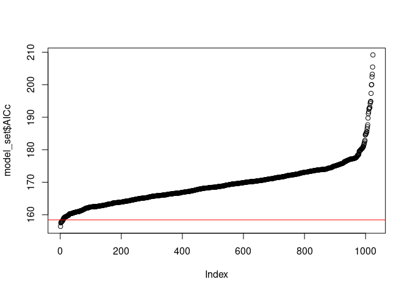

model selection
================
N. Schenk
2023-02-01

**Please note that this tutorial is in draft stage.**

# Model selection

This tutorial addresses the question of how a set of potential models
can be reduced to a smaller set of final models, ideally to a single
final value for each parameter estimate.

This tutorial excludes the assessment of bi- or multivariate
associations between explanatory variables, which is an essential step
before defining the set of potential models.

Further reading - Highly recommended : Grace, J. B., and K. M. Irvine.
2020. Scientist’s guide to developing explanatory statistical models
using causal analysis principles. Ecology 101(4):e02962.
10.1002/ecy.2962

Outlook : using the `metafor` package.

[External
source](https://sites.google.com/site/rforfishandwildlifegrads/home/mumin_usage_examples?pli=1)
for additional reading.

## Dependencies

``` r
# install.packages("MuMIn")
library(MuMIn)
```

# model selection by hand

``` r
library(AED)
data("biodiversity")

# na.fail : need to handle NA values BEFORE using the model 
#    because models which are fit on different subsets of rows are NOT comparable
mod1 <- lm(biomass ~ treatment + nutrient + concentration + mesocosm, data = Biodiversity, na.action = na.fail)
summary(mod1)
```

    ## 
    ## Call:
    ## lm(formula = biomass ~ treatment + nutrient + concentration + 
    ##     mesocosm, data = Biodiversity, na.action = na.fail)
    ## 
    ## Residuals:
    ##       Min        1Q    Median        3Q       Max 
    ## -0.186475 -0.071360 -0.000082  0.071495  0.187245 
    ## 
    ## Coefficients:
    ##                   Estimate Std. Error t value Pr(>|t|)    
    ## (Intercept)      -2.529969   0.073989 -34.194   <2e-16 ***
    ## treatmentNoAlgae  2.229143   0.048847  45.635   <2e-16 ***
    ## nutrientNO3       0.001086   0.034508   0.031    0.975    
    ## nutrientPO3       0.001033   0.034025   0.030    0.976    
    ## concentration     0.000150   0.002587   0.058    0.954    
    ## mesocosm          0.371405   0.006941  53.505   <2e-16 ***
    ## ---
    ## Signif. codes:  0 '***' 0.001 '**' 0.01 '*' 0.05 '.' 0.1 ' ' 1
    ## 
    ## Residual standard error: 0.123 on 102 degrees of freedom
    ## Multiple R-squared:  0.9657, Adjusted R-squared:  0.964 
    ## F-statistic: 574.6 on 5 and 102 DF,  p-value: < 2.2e-16

``` r
# fixed : define fixed variables that MUST stay in the model, e.g. the treatment variable of an experiment
#    note : keep this also if not significant!
dredge(mod1, beta = "none", fixed = c("treatment"))
```

    ## Fixed terms are "treatment" and "(Intercept)"

    ## Global model call: lm(formula = biomass ~ treatment + nutrient + concentration + 
    ##     mesocosm, data = Biodiversity, na.action = na.fail)
    ## ---
    ## Model selection table 
    ##   (Intrc)     cncnt  mscsm ntrnt trtmn df   logLik   AICc  delta weight
    ## 3 -2.5290           0.3714           +  4   76.173 -144.0   0.00  0.677
    ## 4 -2.5290 9.804e-05 0.3714           +  5   76.175 -141.8   2.20  0.226
    ## 7 -2.5290           0.3714     +     +  6   76.173 -139.5   4.44  0.073
    ## 8 -2.5300 1.500e-04 0.3714     +     +  7   76.175 -137.2   6.73  0.023
    ## 1  1.0000                            +  3 -105.970  218.2 362.13  0.000
    ## 2  0.9669 5.423e-03                  +  4 -105.848  220.1 364.04  0.000
    ## 5  1.0000                      +     +  5 -105.970  222.5 366.49  0.000
    ## 6  0.9104 8.290e-03            +     +  6 -105.783  224.4 368.36  0.000
    ## Models ranked by AICc(x)

# Model selection and averaging with the MuMIn package

Code partly generated by ChatGPT

``` r
# Load an example data set with 10 variables
data(mtcars)

# Fit a full model with all 10 variables
full_model <- lm(mpg ~ ., data = mtcars, na.action = "na.fail")
# note : the na.action has to be set to "na.fail" in order to prevent an error in the dredge function

# Use the dredge() function to perform model selection
model_set <- dredge(full_model)
```

    ## Fixed term is "(Intercept)"

``` r
# Visualise the AIC values
plot(model_set$AICc)
abline(h = (min(model_set$AICc) + 2), col = "red")
```

<!-- -->

``` r
# Extract the best models
# AIC is +- 2 points (https://www.cellulestat.cra.wallonie.be/wp-content/uploads/2016/12/Formation_Stats_3_3_Model_selection.pdf)
best_models <- model_set[model_set$AICc < min(model_set$AICc) + 2, ]

# Calculate the average model using the model.avg() function
average_model <- model.avg(best_models)
```

In this example, dredge() performs a stepwise model selection by testing
all possible models (subsets of variables) in the full_model and returns
a summary of the models with their respective Akaike Information
Criterion (AIC) values. The which.min() function is then used to extract
the models with the lowest AIC values (the best models), within a range
of 2 AIC points. Finally, the model.avg() function is used to calculate
the average model from the best models.
