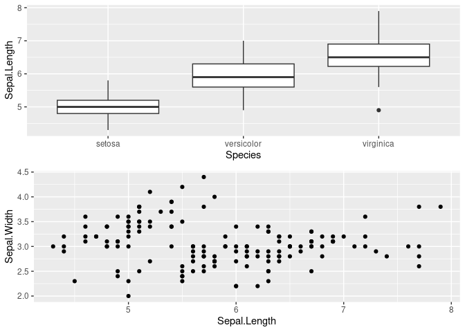

Plotting in R
================
N. V. Schenk
2023-06-01

# Requirements

``` r
library(ggplot2)
library(cowplot)
data(iris)
```

# Saving plot output as pdf

## Saving an R base plot

For plots generated with Rbase (usually applies for plots NOT generated
with ggplot2) :

``` r
# save in A4 format "portrait"
pdf("output_a4.pdf", paper="a4")
plot(iris$Sepal.Length, iris$Sepal.Width)
dev.off()
```

    ## png 
    ##   2

``` r
# save in A4 format "landscape"
pdf("output_a4.pdf", paper="a4r")
plot(iris$Sepal.Length, iris$Sepal.Width)
dev.off()
```

    ## png 
    ##   2

## Saving a ggplot

You can use the `ggplot2` function `ggsave`, or the saving function
`save_plot` from `cowplot` (recommended).

``` r
a <- ggplot(iris, aes(x = Species, y = Sepal.Length)) +
  geom_boxplot()
b <- ggplot(iris, aes(x = Sepal.Length, y = Sepal.Width)) +
  geom_point()
c <- plot_grid(a, b, nrow = 2)

# # #
# save plot with save_plot() function from cowplot package (recommended)
save_plot(c, file = "a4_output_save_plot.pdf", base_width = 210, base_height = 297, units = "mm") # portrait
save_plot(c, file = "a4_output_save_plot.pdf", base_width = 297, base_height = 210, units = "mm") # landscape

# # #
# alternatively : save plot with ggsave() function from ggplot2
#
# portrait
ggsave(file = "a4_output_ggsave.pdf", width = 210, height = 297, units = "mm")
c
```

<!-- -->

``` r
dev.off()
```

    ## null device 
    ##           1

``` r
# lanscape
ggsave(file = "a4_output_ggsave_landscape.pdf", width = 297, height = 210, units = "mm")
c
dev.off()
```

    ## null device 
    ##           1
