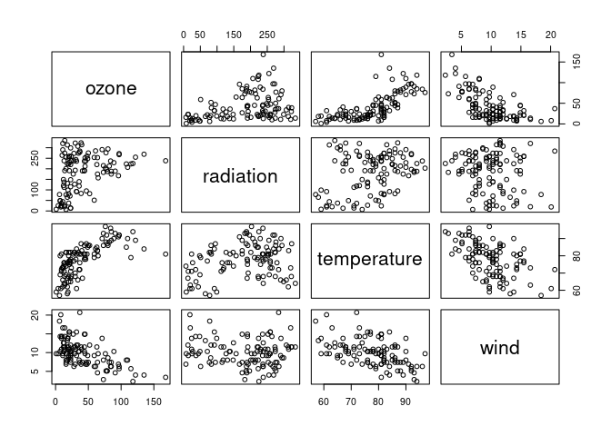
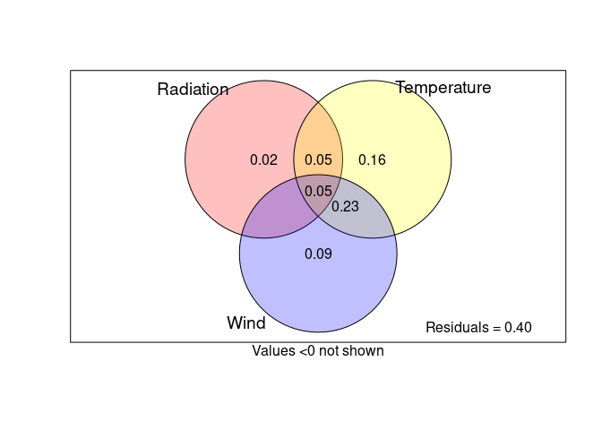

Variance partitioning
================
N. V. Schenk
2023-05-23

**Aim**: minimal script describing procedure for variance partitioning
in univariate linear models.

**Requirements**

``` r
library(lattice)
library(vegan)
```

    ## Loading required package: permute

    ## This is vegan 2.6-4

``` r
ozone <- lattice::environmental
head(ozone)
```

    ##   ozone radiation temperature wind
    ## 1    41       190          67  7.4
    ## 2    36       118          72  8.0
    ## 3    12       149          74 12.6
    ## 4    18       313          62 11.5
    ## 5    23       299          65  8.6
    ## 6    19        99          59 13.8

``` r
plot(ozone)
```

<!-- -->

``` r
# neg corr between temperature and wind, maybe ozone and wind
# pos corr between ozone and temperature


mod1 <- lm(ozone ~ radiation + temperature + wind, data = ozone)
summary(mod1)
```

    ## 
    ## Call:
    ## lm(formula = ozone ~ radiation + temperature + wind, data = ozone)
    ## 
    ## Residuals:
    ##     Min      1Q  Median      3Q     Max 
    ## -40.485 -14.210  -3.556  10.124  95.600 
    ## 
    ## Coefficients:
    ##              Estimate Std. Error t value Pr(>|t|)    
    ## (Intercept) -64.23208   23.04204  -2.788  0.00628 ** 
    ## radiation     0.05980    0.02318   2.580  0.01124 *  
    ## temperature   1.65121    0.25341   6.516 2.43e-09 ***
    ## wind         -3.33760    0.65384  -5.105 1.45e-06 ***
    ## ---
    ## Signif. codes:  0 '***' 0.001 '**' 0.01 '*' 0.05 '.' 0.1 ' ' 1
    ## 
    ## Residual standard error: 21.17 on 107 degrees of freedom
    ## Multiple R-squared:  0.6062, Adjusted R-squared:  0.5952 
    ## F-statistic: 54.91 on 3 and 107 DF,  p-value: < 2.2e-16

``` r
# ozone increases with increasing radiation and increasing temperature
# ozone decreases with increasing wind
anova(mod1)
```

    ## Analysis of Variance Table
    ## 
    ## Response: ozone
    ##              Df Sum Sq Mean Sq F value    Pr(>F)    
    ## radiation     1  14780   14780  32.971 8.853e-08 ***
    ## temperature   1  47378   47378 105.692 < 2.2e-16 ***
    ## wind          1  11680   11680  26.057 1.450e-06 ***
    ## Residuals   107  47964     448                      
    ## ---
    ## Signif. codes:  0 '***' 0.001 '**' 0.01 '*' 0.05 '.' 0.1 ' ' 1

``` r
# Sum Sq column : sum of squared deviations for each variable included in model
# temp is highest, then radiation, then wind
#TODO SS = var expl?

# plot(mod1) #The curvature in the residuals plot is a little concerning, but let's proceed


#For the linear model we add the variables as so: varpart(Y, X1, X2, X3)
varp.oz <- vegan::varpart(ozone$ozone, ozone$radiation, ozone$temperature,
ozone$wind)
plot(varp.oz, bg = c("red", "yellow", "blue"), Xnames = c("Radiation",
"Temperature", "Wind"))
```

<!-- -->

# ANOVA table does not show shared variances

We can compare the output of the anova table with the variance
partitioning by the vegan::varpart() function.

Reading from the anova table : that the percent variance explained by a
predictor is the sum of squared distances from the mean (Sum Sq) divided
by the total amount of variance.

``` r
# CALCULATING THE VARIANCE EXPLAINED BY HAND
total_sum_sq <- 14780 + 47378 + 11680 + 47964

# RADIATION
14780 / total_sum_sq # 0.121
```

    ## [1] 0.1213445

``` r
# reading values from plot : 
0.02 + 0.05 + 0.05
```

    ## [1] 0.12

``` r
# TEMPERATURE
47378 / total_sum_sq # 0.3889
```

    ## [1] 0.3889756

``` r
# reading values from plot: 
0.16 + 0.05 + 0.05 + 0.23 # 0.49
```

    ## [1] 0.49

``` r
# WIND
11680 / total_sum_sq # 0.095
```

    ## [1] 0.09589334

``` r
# reading values from plot
0.09 + 0.23 + 0.05 # 0.37
```

    ## [1] 0.37

Temperature and wind are highly correlated. Therefore, a large amount of
variance is shared among them. This blurs the picture we get from the
anova table, which correctly estimates the variance explained by each
individual variable if uncorrelated, but underestimates the variance
explained if they share explanatory power.

Quoting directly from ChatGPT :

> In a multiple regression setting with correlated predictors, the
> individual Sum Sq values do not accurately reflect the unique variance
> explained by each predictor variable. The issue arises because the
> contribution of each predictor to the overall variance explained
> depends on the presence of other predictors in the model. When
> predictors are correlated, they share some common variance, and the
> individual Sum Sq values do not separate out the unique variance
> attributed to each predictor.

## Calculation by hand

To get a better estimation, we would need to run individual models and
observe their anova tables:

``` r
# Temperature as example : 
mod2 <- lm(ozone ~ temperature, data = ozone)
anova(mod2) # SS = 59434
```

    ## Analysis of Variance Table
    ## 
    ## Response: ozone
    ##              Df Sum Sq Mean Sq F value    Pr(>F)    
    ## temperature   1  59434   59434  103.87 < 2.2e-16 ***
    ## Residuals   109  62367     572                      
    ## ---
    ## Signif. codes:  0 '***' 0.001 '**' 0.01 '*' 0.05 '.' 0.1 ' ' 1

``` r
mod2 <- lm(ozone ~ wind + temperature, data = ozone)
anova(mod2) # SS = 25092
```

    ## Analysis of Variance Table
    ## 
    ## Response: ozone
    ##              Df Sum Sq Mean Sq F value    Pr(>F)    
    ## wind          1  45762   45762  97.007 < 2.2e-16 ***
    ## temperature   1  25092   25092  53.190  5.32e-11 ***
    ## Residuals   108  50948     472                      
    ## ---
    ## Signif. codes:  0 '***' 0.001 '**' 0.01 '*' 0.05 '.' 0.1 ' ' 1

``` r
mod2 <- lm(ozone ~ radiation + temperature, data = ozone)
anova(mod2) # SS = 47378
```

    ## Analysis of Variance Table
    ## 
    ## Response: ozone
    ##              Df Sum Sq Mean Sq F value    Pr(>F)    
    ## radiation     1  14780   14780  26.762 1.068e-06 ***
    ## temperature   1  47378   47378  85.789 2.216e-15 ***
    ## Residuals   108  59644     552                      
    ## ---
    ## Signif. codes:  0 '***' 0.001 '**' 0.01 '*' 0.05 '.' 0.1 ' ' 1

``` r
mod2 <- lm(ozone ~ radiation + wind + temperature, data = ozone)
anova(mod2) # SS = 19032
```

    ## Analysis of Variance Table
    ## 
    ## Response: ozone
    ##              Df Sum Sq Mean Sq F value    Pr(>F)    
    ## radiation     1  14780   14780  32.971 8.853e-08 ***
    ## wind          1  40026   40026  89.292 9.002e-16 ***
    ## temperature   1  19032   19032  42.457 2.429e-09 ***
    ## Residuals   107  47964     448                      
    ## ---
    ## Signif. codes:  0 '***' 0.001 '**' 0.01 '*' 0.05 '.' 0.1 ' ' 1

``` r
59434 / total_sum_sq # 0.488
```

    ## [1] 0.4879559

``` r
# from vegan output : 
0.16 + 0.23 + 0.05 + 0.05 # 0.49
```

    ## [1] 0.49

``` r
# variance not shared with radiation : 
47378 / total_sum_sq # 0.3889756
```

    ## [1] 0.3889756

``` r
0.16 + 0.23 # reading from plot : 0.39
```

    ## [1] 0.39

``` r
# variance not shared with wind : 
25092 / total_sum_sq # 0.2060065
```

    ## [1] 0.2060065

``` r
0.16 + 0.05 # 0.21
```

    ## [1] 0.21

``` r
# variance not shared with radiation and wind
19032 / total_sum_sq # 0.1562536
```

    ## [1] 0.1562536

``` r
# 0.16
```

By combining the individual pieces of information, we can calculate the
variance explained of all remainig combinations of shared/ unshared
variance.

We recommend to calculate the variance partitioning by hand for practice
purposes - it’s just way easier to understand the procedure if you have
done it by hand at least once.

# References

- Example and code based on [this
  course](https://sites.ualberta.ca/~ahamann/teaching/renr690/labs/Lab9e.pdf)
